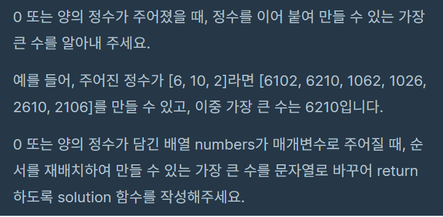
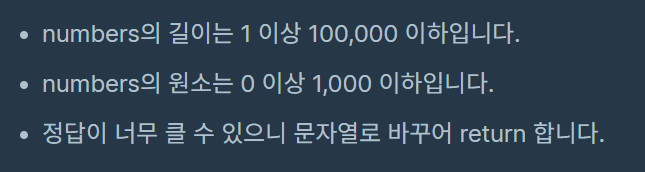
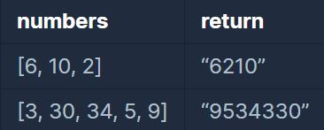

<br />

## Contents
1. 문제 설명 
2. 알고리즘 분석 
3. 느낀 점 

<br />

## 문제 설명 



<br />

#### 제한 사항



<br />

#### 입출력 예



<br /><br />


## 알고리즘 분석 
&nbsp;&nbsp;이번 문제는 아쉽게도 자력으로 해결하지 못했다.
리스트로 주어지는 입력 값을 조합하여 가장 큰 숫자를 만드는 것은 얼핏봤을 때 쉬워보였다. 하지만 직접 코딩하다 보니 큰 장벽에 부딪히는 것을 느낄 수 있었다. 그 이유는 문제가 지닌 특수한 조건 때문이다. 

&nbsp;&nbsp;[3, 30, 34, 5, 9] 라는 리스트가 있다고 가정한다면, 리스트의 요소를 그대로 이어붙였을 때 가장 큰 수가 나오게 정렬한다면 [9, 5, 34, 3, 30] 이 될것이다. 하지만 리스트의 요소들을 모두 문자열로 바꾼 후 내림차순으로 정렬한다면 어떻게 될까? 

['9', '5', '34', '30', '3'] 이라는 결과가 나온다. 

이런 결과가 나오는 이유는 문자열을 정렬할 때, 문자열의 인덱스 값이 낮은 값에 들어있는 숫자가 클 수록 크다는 것이다. 

쉽게 설명하자면, 
(9 ,34) 가 정수일 경우, 34의 값이 더 크다. 
('9' ,'34') 가 문자열일 경우, 첫 번째 인덱스 값이 '9' 와 '3' 이기 때문에 '9'가 더 큰 것이다. 
이런 이유로 위와 같은 결과가 나오는 것인데 그러한 특성을 감안하더라도 원하는 정렬 값을 얻지 못한다. 

'30' 과 '3'을 비교했을 때, '3'이 우선시 되어야하지만 '30'이 우선시 되기 때문이다. 두 숫자를 조합했을 때, '303' < '330'이기 때문이다.    

이 문제를 해결하려면 
> '3' == '33' 

위와 같이 '3'이 '33'과 통일한 우선순위를 지녀야한다.

나는 코드로 위와같은 문제를 해결하기 위해 코딩해봤지만 풀리지 않고 코드는 50줄이 넘어가서 구글링을 하게되었다. 

다음은 좋아요를 가장 많이받은 Most 1 코드이다. 
```python
def solution(numbers):
    numbers = list(map(str, numbers))
    numbers.sort(key=lambda x: x*3, reverse=True)
    return str(int(''.join(numbers)))
```
> numbers = list(map(str, numbers))

우선 list와 map을 이용하여 numbers 리스트의 요소를 모두 문자열로 바꿔준다. 
> numbers.sort(key=lambda x: x*3, reverse=True)

이 부분이 진짜 대단한 부분인데, 
key = lambda x:x*3 을 이용하여 정렬의 기준을 각 요소를 3 곱하기 한 것으로 삼는 것이다. 

예를 들어 '3' 과 '30'을 비교한다고 가정해보자 

```
'3' * 3 = '333' 
'30' * 3 = '303030' 
'333' > '303030' 
```

위와 같이 '333'이 우선순위가 높이 때문에 '3'이 '30' 높은 숫자로 취급받는다.

여기서 왜 하필 3을 곱해줄까? 

그 이유는 제한사항에 있다. 
- numbers의 원소는 0 이상 1,000 이하입니다.

'998' 과 '9' 가 있다고 가정한다. 
여기서 곱하기 2를 하면 
```
'9' * 2 = '99'
'998' * 2 = '998998' 
'99' < '998998'
``` 
만약 3을 곱한다면? 
```
'9' * 3 = '999'
'998' * 3 = '998998998'
'999' > '998998998' 
```
다음과 같은 결과가 나오기 때문에 3을 곱하는 것이다. 

<br /><br />


## 느낀점 
&nbsp;&nbsp;Level 1의 문제들을 풀고 어느 정도 파이썬을 할줄 안다고 자신감에 차 있었지만, 세상에 천재는 많다는 것을 느꼈다. 
아직은 가야할 길이 많이 남은 것 같다.  
